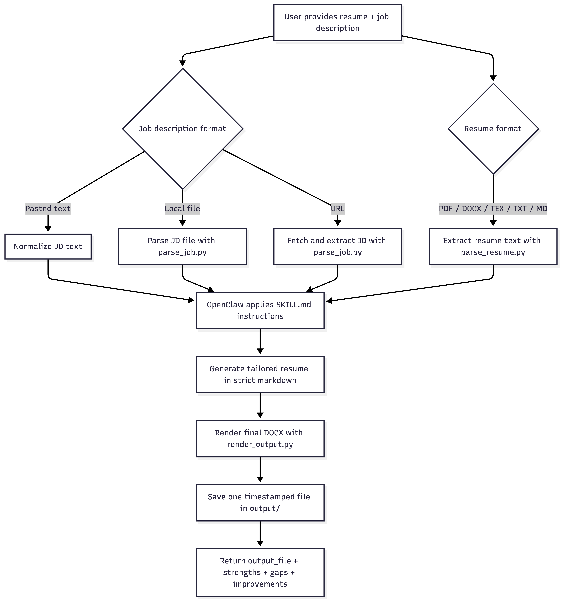

# 📑 Resume Tailor

`resume-tailor` is an OpenClaw skill that takes an existing resume plus a target job description, tailors the resume without inventing facts, and saves one final `.docx` output you can review or test.

In practice, the skill is designed for prompts like:

- "Tailor this resume for the attached job description"
- "Use this resume and this job link to generate a targeted version"
- "Rewrite my resume for this role and save the output file"

The model handles the tailoring logic. The local scripts in this folder handle input parsing, job-description normalization, and final DOCX rendering.



## What the Skill Does

For each run, the skill should:

1. Read a source resume from a supported file format.
2. Read a target job description from pasted text, a local file, or a URL.
3. Generate a tailored resume internally in a strict markdown schema.
4. Render exactly one final `.docx` file into `output/`
5. Return only a concise result payload:
   - `output_file`
   - `strengths`
   - `gaps`
   - `improvements`

The full tailored resume should not be pasted back into chat.

## Supported Inputs

Resume input formats currently supported by the parser:

- `.pdf`
- `.docx`
- `.tex`
- `.txt`
- `.md`

Job description inputs currently supported:

- pasted job description text
- local text file
- job posting URL

## Important Behavior

- The original resume is never overwritten.
- The skill should only strengthen or reorder content already supported by the source resume.
- The final saved output must be exactly one `.docx` file.
- The workflow is markdown-first internally, but the final artifact is DOCX-only.
- The skill is optimized for a compact, one-page-first resume when the source content supports it.

## Repository Layout

```text
resume-tailor/
├── README.md                   # Setup and usage guide
├── SKILL.md                    # OpenClaw skill instruction
├── evals/  
│   └── evals.json              # Evaluating OpenClaw outputs
├── input/                      # Example resume in various formats
│   ├── sample_resume1.pdf
│   ├── sample_resume2.docx
│   ├── sample_resume3.tex
│   ├── sample_resume4.docx
│   └── sample_resume5.pdf
├── output/                     # The tailored resume
├── sample_jobs/
│   └── ibm_de.txt              # Paste job description here
└── scripts/
    ├── parse_job.py            # Parse job description (from url, text, etc.)
    ├── parse_resume.py         # Parse resume
    ├── render_output.py        # Convert LLM output to .docx format
    └── utils.py
```

## End-to-End Skill Flow

OpenClaw should use the skill roughly like this:

1. Parse the input resume.
2. Parse or fetch the job description.
3. Ask the model to produce a tailored resume in the strict markdown format from [`SKILL.md`](https://github.com/lqminhhh/openclaw-resume-tailor/blob/main/SKILL.md).
4. Render the markdown into a single `.docx`.
5. Return the saved output path plus concise review notes.

## Add This Skill to OpenClaw

To make this skill available in OpenClaw, place the entire `resume-tailor/` directory inside the OpenClaw skills directory so that OpenClaw can discover [`SKILL.md`](https://github.com/lqminhhh/openclaw-resume-tailor/blob/main/SKILL.md).

Typical setup:

1. Copy this folder into your OpenClaw skills path.
2. Keep the folder name as `resume-tailor`.
3. Make sure [`SKILL.md`](https://github.com/lqminhhh/openclaw-resume-tailor/blob/main/SKILL.md) stays at the root of the skill folder.
4. Keep the helper scripts in `scripts/` and the generated files in `output/`.

The resulting layout inside OpenClaw should look like:

```text
skills/
└── resume-tailor/
    ├── SKILL.md
    ├── README.md
    ├── scripts/
    ├── input/
    ├── sample_jobs/
    ├── output/
    └── evals/
```

Once installed, invoke it in OpenClaw by naming the skill in your prompt and providing both a resume and a target job description, for example:

```text
Use the resume-tailor skill to tailor skills/resume-tailor/input/sample_resume4.docx for this job description: skills/resume-tailor/sample_jobs/ibm_de.txt
```

Or with a job URL:

```text
Use the resume-tailor skill to tailor my attached resume for this role: https://example.com/job-posting
```

OpenClaw should then use the skill instructions in [`SKILL.md`](https://github.com/lqminhhh/openclaw-resume-tailor/blob/main/SKILL.md), run the local parsing/rendering workflow, and save one final `.docx` file in `output/`.

## Local Script Usage

### 1. Extract Resume Text

```bash
python scripts/parse_resume.py --resume input/sample_resume4.docx
```

Example with PDF:

```bash
python scripts/parse_resume.py --resume input/sample_resume1.pdf
```

### 2. Normalize a Job Description

From a local file:

```bash
python scripts/parse_job.py --jd-file sample_jobs/ibm_de.txt
```

From pasted text:

```bash
python scripts/parse_job.py --jd-text "Data Engineer Intern role focused on SQL, Python, ETL, and analytics workflows."
```

From a URL:

```bash
python scripts/parse_job.py --jd-url "https://example.com/job-posting"
```

Note: URL mode requires network access and depends on how readable the target job page is.

### 3. Render a Tailored Resume to DOCX

If you already have strict markdown resume content in a file:

```bash
python scripts/render_output.py \
  --content-file /path/to/tailored_resume.md \
  --output-dir output \
  --base-name sample_resume4_target_role
```

This writes a timestamped DOCX like:

```text
output/sample_resume4_target_role_20260327_203000.docx
```

You can also render inline content:

```bash
python scripts/render_output.py \
  --content "# Jane Doe

jane@example.com | 555-555-5555 | LinkedIn

## EDUCATION
**Example University** | May 2026
*B.S. Computer Science* | Boston, MA

## SKILLS
**Languages:** Python, SQL" \
  --output-dir output \
  --base-name jane_doe_demo
```

## How to Test This Skill

The easiest manual test is:

1. Pick a resume from `input/`.
2. Pick a job description from `sample_jobs/` or use a live URL.
3. Run the skill through OpenClaw with both inputs.
4. Confirm that exactly one new `.docx` file appears in `output/`.
5. Open the generated file and verify that the content is tailored, compact, and still factually faithful to the source resume.

If you want to test the local pieces independently:

1. Run `scripts/parse_resume.py` on the source resume.
2. Run `scripts/parse_job.py` on the job input.
3. Provide a strict markdown resume to `scripts/render_output.py`.
4. Confirm the renderer writes one timestamped `.docx`.

## Evals

`evals/evals.json` contains sample evaluation cases covering:

- PDF resume + job URL
- DOCX resume + job URL
- TEX resume + job URL
- PDF resume + pasted or file-backed job description

The `expected_notes_file` values point to example outputs already generated in `output/`.

## Current Limitations

- URL extraction is best-effort and may be incomplete for dynamic or heavily protected job pages.
- This repository provides the skill contract plus helper scripts; the actual tailoring step is still performed by the model during the OpenClaw run.
